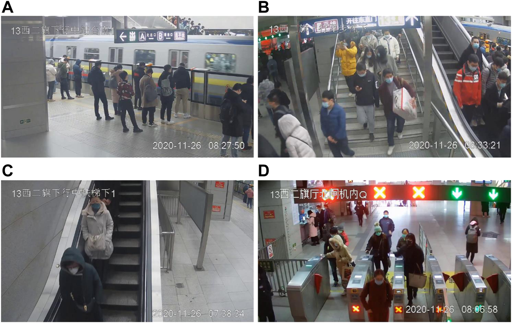
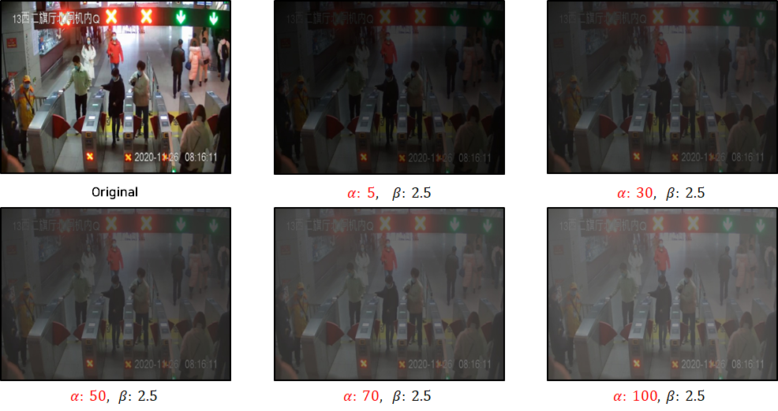
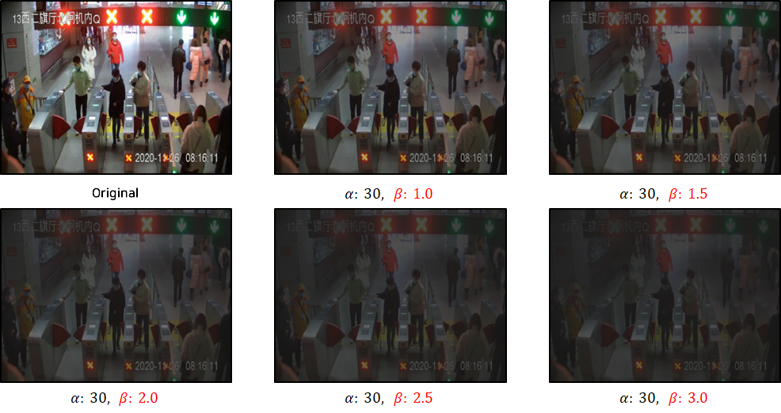
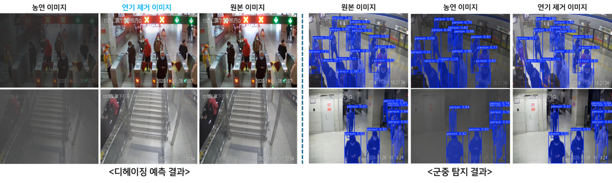
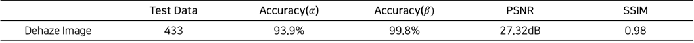

# Metro-Fire-Project
Physical AI &amp; Hologram-based Smart Fire Evacuation System for Unmanned Subways

## ⚙️ Setup
### 1. Dependencies and Installation
We recommend using `Python>=3.10`
```bash
conda create --name metro_fire python=3.10
conda activate metro_fire
pip install -U pip

# Install requirements in each folders (AECR-Net, haze-synthesis, YOLO)
pip install -r requirements.txt
```
Please check for details 
- [AECR-Net](https://github.com/GlassyWu/AECR-Net.git)
- [haze-synthesis](https://github.com/tranleanh/haze-synthesis.git)
- [yolov12](https://github.com/sunsmarterjie/yolov12.git)

### 2. Datasets
We used MetroStation dataset for training and inference.

You can download at the link below.
- [MetroStation](https://figshare.com/articles/dataset/MetroStation_Dataset/20521848?file=36732258)


## Smoke Image Synthesis
You can generate smoked images using the command below.
(You can control the smoke density by adjusting the beta and airlight value.)
```bash
cd haze-synthesis/
python main.py --image_path #Your Dataset Path# --model_name mono+stereo_640x192 --output_image_path ./outputs --beta 2.5 --airlight 100
```

## Train
### 1. Dehazing and Smoke Density Prediction Network
You can train the model using the command below.
```bash
cd AECR-Net/
python train_aecrnet.py \
  --net cdnet \
  --trainset DH_train \
  --testset DH_test \
  --crop \
  --crop_size 256 \
  --bs 16 \
  --lr 0.0002 \
  --epochs 100 \
  --eval_step 1000 \
  --w_loss_l1 1.0 \
  --w_loss_vgg7 0.1 \
  --model_name aecrnet_metro_multitask_reg \
  --model_dir ./trained_models/aecrnet_metro_multitask_reg.pth
```

### 2. Multimodal Fire Presence Detection Model
You can train the model using the command below.
```bash
cd AECR-Net/
python multifire_train.py
```


## Inference
### 1. Dehazing and Smoke Density Prediction Network
You can run inference on the model using the command below.
```bash
cd AECR-Net/
python test_eval_regression.py \
  --model_path ./trained_models/DH_train_cdnet_aecrnet_metro_multitask_reg.pth.best \
  --output_dir ./metro_final_test_results \
  --pred_dir ./metro_pure_predictions \
  --haze_dir ./metro_pure_haze_inputs
```

### 2. Multimodal Fire Presence Detection Model
You can run inference on the model using the command below.
```bash
cd AECR-Net/
python multifire_test.py
```

### 3. Human Detection Model
You can run inference on the model using the command below.
```bash
cd YOLO/
python multifire_test.py
```


## Results
### 1. Generated Dehazed Images



### 2. Dehazing and Smoke Density Prediction Results




## 🤗 Acknowledgements
We thank the authors of the following projects!
- [AECR-Net](https://github.com/GlassyWu/AECR-Net.git)
- [haze-synthesis](https://github.com/tranleanh/haze-synthesis.git)
- [yolov12](https://github.com/sunsmarterjie/yolov12.git)
